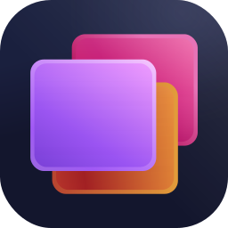

<p align="center">
  
</p>

<h1 align="center">AgentPanel</h1>

<p align="center">
A macOS menu bar app for engineers who work across many repositories.<br>
One hotkey to switch projects, with your IDE, browser, tabs, and window layout restored automatically.
</p>

AgentPanel manages [AeroSpace](https://github.com/nikitabobko/AeroSpace) workspaces behind the scenes so each project gets its own isolated desktop context. Switch in, do your work, switch out. No manual window shuffling.

Product direction: AgentPanel is intended to be the single place you run your day-to-day workspace workflow, with AeroSpace acting as the underlying engine.

For users who want an uncluttered menu bar, it can be desirable to remove or hide the AeroSpace menu bar item and keep AgentPanel as the visible control point. This is optional and currently outside AgentPanel-managed behavior.

## Features

- **One-hotkey project switching** -- `Cmd+Shift+Space` opens a searchable project list sorted by recency.
- **Deterministic activation** -- each project opens in its own workspace with VS Code, Chrome, and your saved tab state.
- **Chrome tab persistence** -- tabs are captured on close and restored on activate. No more lost browser context.
- **Window layout management** -- side-by-side positioning with configurable rules. Adapts to screen size automatically.
- **Project-scoped window cycling overlay** -- hold `Option` and tap `Tab` to preview project windows, then release `Option` to commit the highlighted window.
- **SSH remote projects** -- works with VS Code Remote-SSH for remote development workflows.
- **Built-in diagnostics** -- `Doctor` checks your setup end-to-end, opens immediately with loading feedback, and renders a color-coded report with actionable fixes.
- **CLI included** -- `ap doctor`, `ap select-project`, `ap close-project`, and more for scripting and automation.
- **Self-healing** -- circuit breaker and auto-recovery when AeroSpace crashes. No manual restarts needed. Off-screen windows are automatically recovered when focused.
- **Color coding** -- each project gets a distinct color in VS Code via the Peacock extension.

## Requirements

- macOS 15.7 or later (Apple Silicon)
- [AeroSpace](https://github.com/nikitabobko/AeroSpace) -- installed automatically on first launch if Homebrew is available
- [VS Code](https://code.visualstudio.com/)
- [Google Chrome](https://www.google.com/chrome/)
- [Homebrew](https://brew.sh/) -- for automatic AeroSpace installation

Optional:
- [Peacock](https://marketplace.visualstudio.com/items?itemName=johnpapa.vscode-peacock) VS Code extension for project color differentiation

## Install

### App

1. Download `AgentPanel-v<version>-macos-arm64.dmg` from [GitHub Releases](../../releases).
2. Open the DMG and drag `AgentPanel.app` to `/Applications`.
3. Launch AgentPanel. On first launch it will offer to install and configure AeroSpace.

### CLI (optional)

The `ap` command-line tool gives you access to project switching and diagnostics from the terminal.

**Option A: PKG installer**
```sh
# Download and run ap-v<version>-macos-arm64.pkg
ap --version
```

**Option B: Manual install**
```sh
tar -xzf ap-v<version>-macos-arm64.tar.gz
sudo mv ap /usr/local/bin/ap
# If Gatekeeper blocks execution:
xattr -d com.apple.quarantine /usr/local/bin/ap
```

## Quick Start

1. Launch AgentPanel from `/Applications`. Complete the onboarding prompt (installs AeroSpace if needed).

2. Create your config file at `~/.config/agent-panel/config.toml`:

```toml
[[project]]
name = "My Project"
path = "/Users/you/src/my-project"
color = "blue"

[[project]]
name = "Another Project"
path = "/Users/you/src/another-project"
color = "green"
```

3. Press `Cmd+Shift+Space` to open the switcher. Select a project and press `Enter`.

AgentPanel creates a workspace, opens VS Code and Chrome, and positions your windows. Press `Cmd+Shift+Space` again to switch to a different project.

## Configuration

Config file: `~/.config/agent-panel/config.toml`

Use **View Config File...** from the menu bar to open it (creates a starter file if missing).

### Full example

```toml
[app]
autoStartAtLogin = true

[chrome]
pinnedTabs = ["https://github.com/org/repo/pulls"]
defaultTabs = ["https://calendar.google.com"]
openGitRemote = true

[layout]
smallScreenThreshold = 24  # inches; below this, windows maximize
windowHeight = 90           # percent of screen height
maxWindowWidth = 18          # inches
idePosition = "left"         # "left" or "right"
justification = "right"      # which screen edge to align to
maxGap = 10                  # percent; gap between windows

[[project]]
name = "AgentPanel"
path = "/Users/you/src/agent-panel"
color = "indigo"
useAgentLayer = true
chromePinnedTabs = ["https://linear.app"]
chromeDefaultTabs = ["https://docs.example.com"]

[[project]]
name = "Remote ML"
remote = "ssh-remote+user@host"
path = "/home/user/src/remote-ml"
color = "#009688"
```

### `[app]` section

| Key | Type | Default | Description |
|-----|------|---------|-------------|
| `autoStartAtLogin` | bool | `false` | Launch AgentPanel when you log in |

### `[agentLayer]` section

| Key | Type | Default | Description |
|-----|------|---------|-------------|
| `enabled` | bool | `false` | Global default for `useAgentLayer` on all projects |

### `[chrome]` section

| Key | Type | Default | Description |
|-----|------|---------|-------------|
| `pinnedTabs` | [string] | `[]` | URLs always opened as leftmost tabs |
| `defaultTabs` | [string] | `[]` | URLs opened when no tab history exists |
| `openGitRemote` | bool | `false` | Auto-open the git remote URL |

### `[layout]` section

Requires Accessibility permission (grant via System Settings > Privacy & Security > Accessibility).
If permission is missing, AgentPanel requests it automatically once per installed app build on startup. You can also request it manually from Doctor.

| Key | Type | Default | Description |
|-----|------|---------|-------------|
| `smallScreenThreshold` | number | `24` | Screen width in inches below which windows maximize |
| `windowHeight` | integer | `90` | Window height as percent of screen (1--100) |
| `maxWindowWidth` | number | `18` | Maximum window width in inches |
| `idePosition` | string | `"left"` | IDE window side: `"left"` or `"right"` |
| `justification` | string | `"right"` | Screen edge to align windows: `"left"` or `"right"` |
| `maxGap` | integer | `10` | Max gap between windows as percent of screen (0--100) |

### `[[project]]` entries

| Key | Type | Required | Description |
|-----|------|----------|-------------|
| `name` | string | yes | Display name (also used to derive project ID) |
| `path` | string | yes | Absolute path to the repo |
| `color` | string | yes | `"#RRGGBB"` hex or named color |
| `remote` | string | no | VS Code SSH remote authority (e.g., `"ssh-remote+user@host"`) |
| `useAgentLayer` | bool | no | Use Agent Layer launch path for this project |
| `chromePinnedTabs` | [string] | no | Per-project always-open tabs |
| `chromeDefaultTabs` | [string] | no | Per-project default tabs (no history) |

**Named colors:** `black`, `blue`, `brown`, `cyan`, `gray`, `grey`, `green`, `indigo`, `orange`, `pink`, `purple`, `red`, `teal`, `white`, `yellow`

**Project IDs** are derived from `name`: lowercased, non-alphanumeric characters replaced with `-`, repeated dashes collapsed. IDs must be unique. `"inbox"` is reserved.

### Config rules

- Unknown keys are hard failures. AgentPanel does not silently ignore typos.
- Local project `path` must be absolute (starting with `/`).
- SSH projects: `remote` must match `ssh-remote+<authority>` format, `path` is the remote absolute path, and `useAgentLayer` must be `false`.
- All URLs must start with `http://` or `https://`.

## Usage

### Hotkeys

| Shortcut | Action |
|----------|--------|
| `Cmd+Shift+Space` | Open/toggle the project switcher |
| `Option+Tab` | Start/advance overlay selection forward in current workspace |
| `Option+Shift+Tab` | Start/advance overlay selection backward in current workspace |

Window cycling behavior:
- Hold `Option` to keep the overlay open while stepping with `Tab`.
- Release `Option` to focus the highlighted window.
- Workspaces with 0-1 windows skip the overlay and keep immediate cycle semantics.
- If the project switcher is open, overlay display is suppressed to avoid panel conflicts.

### Switcher

| Key | Action |
|-----|--------|
| Type | Filter projects by name |
| `Enter` | Activate selected project |
| `Esc` | Dismiss switcher |
| `Shift+Enter` | Back to Non-Project Space (most recent non-project window) |
| `Cmd+Delete` | Close the selected open project |
| `Cmd+R` | Recover focused workspace windows ("Recover Project") |

### Menu bar

AgentPanel lives in the menu bar with a health indicator icon:

- **Green** = all Doctor checks pass
- **Orange** = warnings present
- **Red** = failures detected

Menu actions:

| Item | Description |
|------|-------------|
| Open Switcher... | Open the project switcher |
| View Config File... | Reveal config in Finder (creates starter if missing) |
| Move Current Window | Move the focused window to a project workspace or back to no project |
| Recover Current Window | Recover only the focused window back on screen |
| Recover Project | Reset window positions in the focused workspace (project layout in project spaces; generic recovery in non-project spaces) |
| Recover All Windows... | Center all windows across all workspaces |
| Run Doctor... | Open the diagnostic panel |
| Launch at Login | Toggle auto-start at login |

## CLI

```
ap <command> [options]
```

| Command | Description |
|---------|-------------|
| `ap doctor` | Run all diagnostic checks (exit 1 on failure) |
| `ap show-config` | Display parsed configuration |
| `ap list-projects [query]` | List projects, optionally filtered |
| `ap select-project <id>` | Activate a project (30s timeout) |
| `ap close-project <id>` | Close a project and return to non-project space |
| `ap return` | Return to most recent non-project window |
| `ap --version` | Print version |

## Doctor

Doctor validates your entire setup and tells you exactly what to fix. Run it from the menu bar (**Run Doctor...**) or the CLI (`ap doctor`).

In the app, Doctor opens immediately with a loading spinner and then renders a color-coded report (PASS/WARN/FAIL) with direct action buttons when relevant.
If Accessibility permission is missing, AgentPanel may also show a startup prompt once per installed build; Doctor remains the manual retry path.

Checks include:

- Homebrew, AeroSpace, VS Code, and Chrome availability
- AeroSpace process running and config managed/up-to-date
- Config file validity (parse errors, unknown keys, value ranges)
- Local project paths exist
- SSH remote paths accessible and settings blocks present
- Agent Layer CLI available (when required)
- Peacock extension installed (when colors are configured)
- Accessibility permission granted (for window positioning)
- Hotkey registration status

Each finding includes a severity (PASS / WARN / FAIL) and an actionable fix. The app UI includes buttons to install AeroSpace, start it, reload config, or request Accessibility permission directly.

## Troubleshooting

**Switcher hotkey does nothing**
- Run `ap doctor` and check the hotkey registration findings.
- Check System Settings for conflicting global shortcuts.

**Window positioning doesn't work**
- Grant Accessibility permission: System Settings > Privacy & Security > Accessibility.
- Run Doctor and confirm the Accessibility check is PASS.

**SSH project activation fails**
- Verify the `remote` format: `ssh-remote+user@host`.
- Ensure `ssh user@host` works non-interactively from your terminal.
- Ensure the remote `.vscode/settings.json` is readable and writable.

**AeroSpace errors or slow recovery**
- Open **Run Doctor...** to inspect AeroSpace status.
- AgentPanel auto-recovers crashed AeroSpace processes (circuit breaker with 30s cooldown, max 2 restart attempts).

**Agent Layer project fails**
- Ensure `al` and `code` are on your PATH.
- Ensure the project has a local `.agent-layer` directory.

**Logs**
- App logs: `~/.local/state/agent-panel/logs/agent-panel.log`
- Rotated: `.1` through `.5` at 10 MiB
- Format: JSON Lines with UTC timestamps

**Data locations**
- Config: `~/.config/agent-panel/config.toml`
- State: `~/.local/state/agent-panel/`
- Chrome tabs: `~/.local/state/agent-panel/chrome-tabs/<projectId>.json`
- Window layouts: `~/.local/state/agent-panel/window-layouts.json`
- AeroSpace config: `~/.aerospace.toml`

## Known Limitations

- Release artifacts are macOS arm64 only (Apple Silicon).
- Homebrew tap distribution is not yet available.
- VS Code and Chrome are currently required for full project activation.

## Development

See [CONTRIBUTING.md](CONTRIBUTING.md) for the full development guide.

```sh
# Prerequisites: Xcode, XcodeGen, xcbeautify (brew install xcodegen xcbeautify)
scripts/dev_bootstrap.sh  # Validate Xcode toolchain (one-time)
make regen                # Generate Xcode project from project.yml
make build                # Build (Debug)
make test                 # Run tests (fast, no coverage)
make coverage             # Run tests with coverage gate (90% minimum)
```

## License

[MIT](LICENSE)
